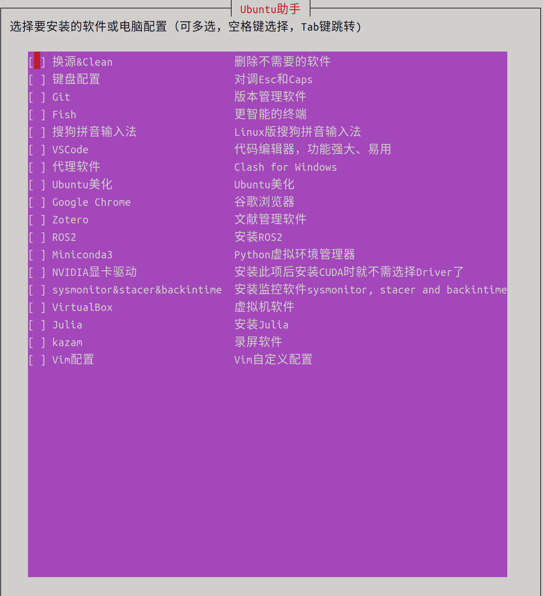

# linux-assistant

<p align="center">
    
</p>

* Ubuntu助手：一键安装软件、进行系统配置
* NOTE：Ubuntu助手不兼容terminator，在terminator中不能自动调整窗口大小。在gnome-terminal中测试通过。
## Getting started
```bash
git clone https://github.com/xu-yang16/linux-assistant.git
cd linux-assistant
bash assistant.sh
```
